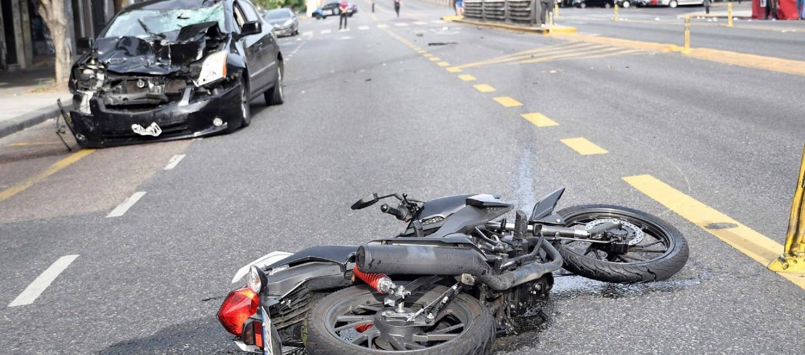
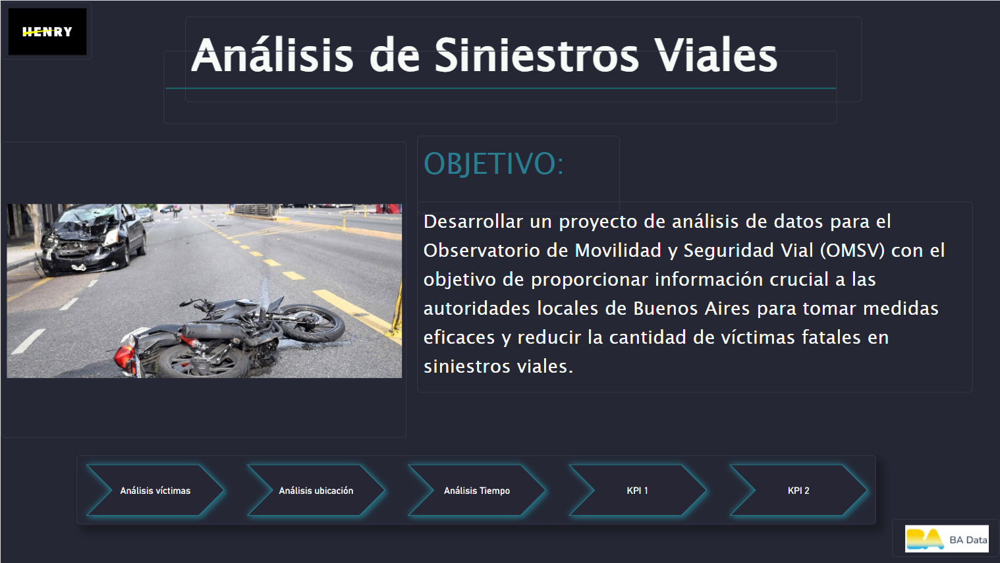
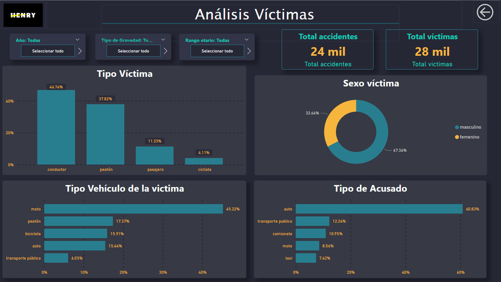
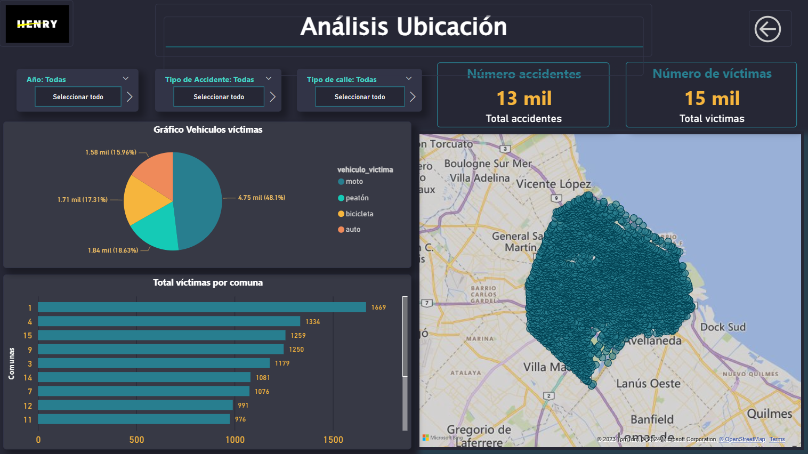
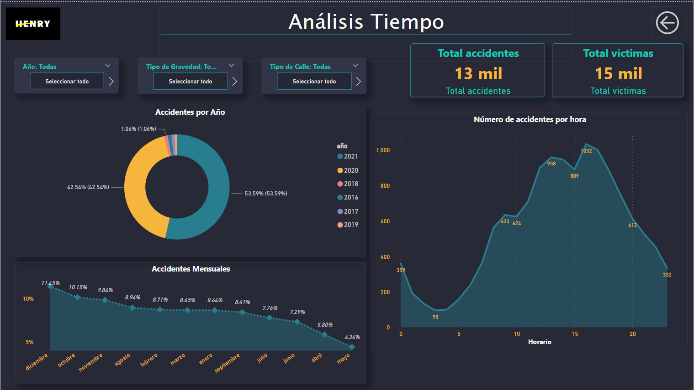
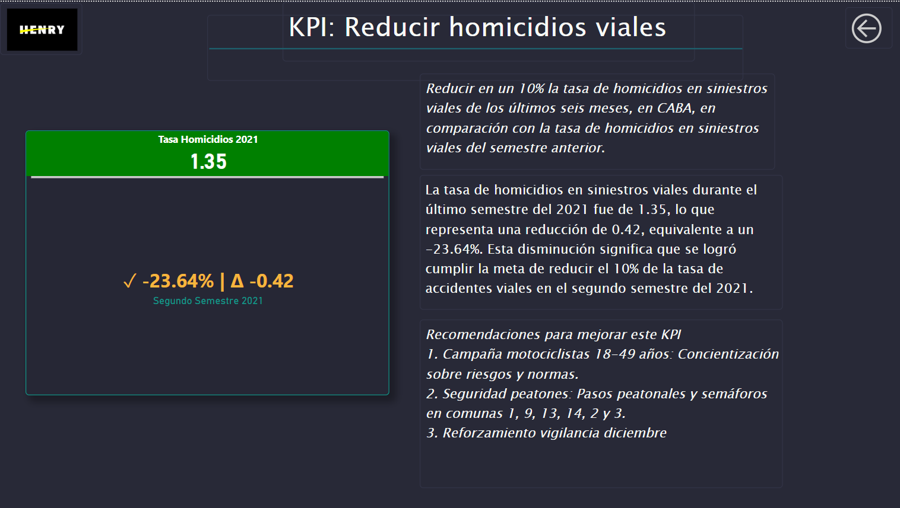
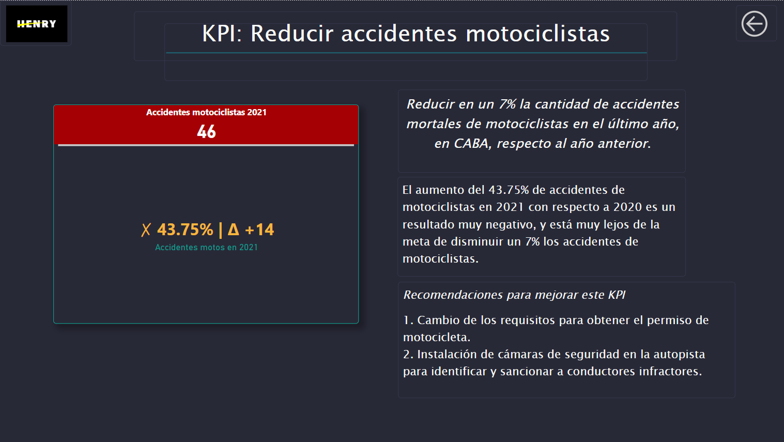

# Análisis de Datos de Siniestros Viales en la Ciudad de Buenos Aires

## Introducción

El objetivo de este proyecto es realizar un análisis para el Observatorio de Movilidad y Seguridad Vial (OMSV) con el fin de proporcionar información crucial a las autoridades locales de Buenos Aires para tomar medidas eficaces y reducir la cantidad de víctimas fatales en siniestros viales.

## **Herramientas Utilizadas**

+ Python
+ PowerBi

## Desarrollo del proyecto

**ETL** : En la fase de ETL, se registraron casos y víctimas de asesinato y agresión. Se llevaron a cabo acciones como la eliminación de columnas irrelevantes, la conversión de valores "SD" a nulos, el cambio de tipos de datos y la estandarización de nombres utilizando la nomenclatura "snake_case". Todos los nombres se escriben en minúsculas y los espacios se reemplazan por guiones bajos.

 **EDA** :Durante la exploración de datos, se identificaron patrones significativos que ofrecieron información valiosa sobre la naturaleza de los datos. Los resultados detallados de este análisis se encuentran en el notebook EDA.

## **Dashboard**:

En Power BI, se ha desarrollado un conjunto de cuatro páginas, que incluye una portada, para proporcionar detalles sobre la ubicación, el momento y las características de las víctimas. También se ha integrado una página dedicada a mostrar los Indicadores Clave de Desempeño (KPI) del proyecto, ofreciendo así una visión completa de los resultados. Este tablero específico está disponible en el repositorio correspondiente.

Recomiendo descargar el panel para acceder a información más detallada e inetractiva. [Dashboard](Dashboard_SiniestrosViales.pbix)

#### Intro del Dashboard

Portada que da la bienvenida y ofrece una visión general del contenido.

####  Analisis Victimas

Información detallada sobre las características de las víctimas.

####  Analisis Ubicación

Información relacionada con las ubicaciones de los accidentes, numero de accidentes, mapa de los accidentes y más.

####  Analisis Tiempo

Datos sobre los accidentes por año, mes y hora.

####  KPI: Reducir homicidios viales (Indicadores Clave de Desempeño)

Página dedicada al Indicador Clave de Desempeño número 1, proporcionando métricas clave para evaluar la reducción de accidentes.

####  KPI: Reducir accidentes motociclistas (Indicadores Clave de Desempeño)

Página dedicada al Indicador Clave de Desempeño número 2, proporcionando métricas clave para evaluar la reducción de accidentes en motocicletas.

### Conclusiones Obtenidas

- En varios años con datos disponibles, la comuna con mayor incidencia de fatalidades fue la número 1. No obstante, en 2021, la comuna con más fatalidades fue la 4.

- La motocicleta es el vehículo más probable en accidentes fatales en autopistas, mientras que en calles, son los peatones.

- Tanto en accidentes fatales como no fatales, la motocicleta es el vehículo más probable tanto para autopistas como para calles.

- En promedio, hay 1.03 víctimas en accidentes fatales y 1.15 en accidentes no fatales.

- Las comunas con menos accidentes fatales son la 5 y 6, mientras que la comuna con menos accidentes no fatales es la 2.

- Las comunas más peligrosas para peatones son la 1, 9, 13, 14, 2 y 5.

- Los accidentes fatales se redujeron significativamente en 2020, posiblemente debido al confinamiento por la pandemia, con una tendencia a la baja desde 2016.

- Diciembre tiene la mayor cantidad de accidentes fatales, y septiembre la menor.

- Diciembre también tiene la mayor cantidad de accidentes no fatales, mientras que mayo tiene la menor.

- Los accidentes no fatales son más frecuentes los sábados y domingos.

- La mayoría de los accidentes no fatales de los fines de semana ocurren entre las 0 y las 5 horas.

- Aproximadamente el 5% de los accidentes resulta en fatalidades, es decir, 1 de cada 20 accidentes.

- Hay más víctimas masculinas que femeninas.

- Las víctimas fatales mayores de 50 años o menores de 18 años son principalmente peatones. En cambio, en otros rangos de edad, la motocicleta es el vehículo más común en incidentes fatales.

## KPI's

**Reducir en un 10% la tasa de homicidios en siniestros viales de los últimos seis meses, en CABA, en comparación con la tasa de homicidios en siniestros viales del semestre anterior**

Se define como el número total de víctimas fatales que hay en dataset por cada 100,000 personas en un área geográfica durante un período de tiempo específico.

Para calcular este KPI, se realizó la comparación entre el penúltimo y último semestre de 2021.

  

La tasa de homicidios en siniestros viales durante el último semestre del 2021 fue de 1.35, lo que representa una reducción de 0.42, equivalente a un -23.64%. Esta disminución significa que se logró cumplir la meta de reducir el 10% de la tasa de accidentes viales en el segundo semestre del 2021.

Recomendaciones para mejorar este KPI

1. Campaña motociclistas 18-49 años: Concientización sobre riesgos y normas.

2. Seguridad peatones: Pasos peatonales y semáforos en comunas 1, 9, 13, 14, 2 y 3.

3. Reforzamiento vigilancia diciembre

**Reducir en un 7% la cantidad de accidentes mortales de motociclistas en el último año, en CABA, respecto al año anterior.**

Definimos a la cantidad de accidentes mortales de motociclistas en siniestros viales como el número absoluto de accidentes fatales en los que estuvieron involucradas víctimas que viajaban en moto en un determinado periodo temporal. Su fórmula para medir la evolución de los accidentes mortales con víctimas en moto es: (Número de accidentes mortales con víctimas en moto en el año anterior - Número de accidentes mortales con víctimas en moto en el año actual) / (Número de accidentes mortales con víctimas en moto en el año anterior) * 100

El aumento del 43.75% de accidentes de motociclistas en 2021 con respecto a 2020 es un resultado muy negativo, y está muy lejos de la meta de disminuir un 7% los accidentes de motociclistas.

Recomendaciones para mejorar este KPI

1. Cambio de los requisitos para obtener el permiso de motocicleta.

2. Instalación de cámaras de seguridad en la autopista para identificar y sancionar a conductores infractores.

## **Links:**

Información extraída de la siguiente página: 
- https://data.buenosaires.gob.ar/dataset/victimas-siniestros-viales

## **LICENCIA:**
Lucas Salzotto

